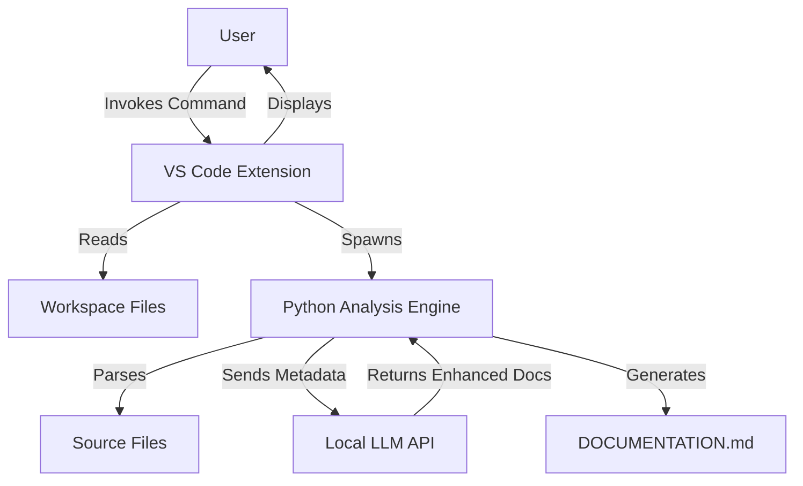
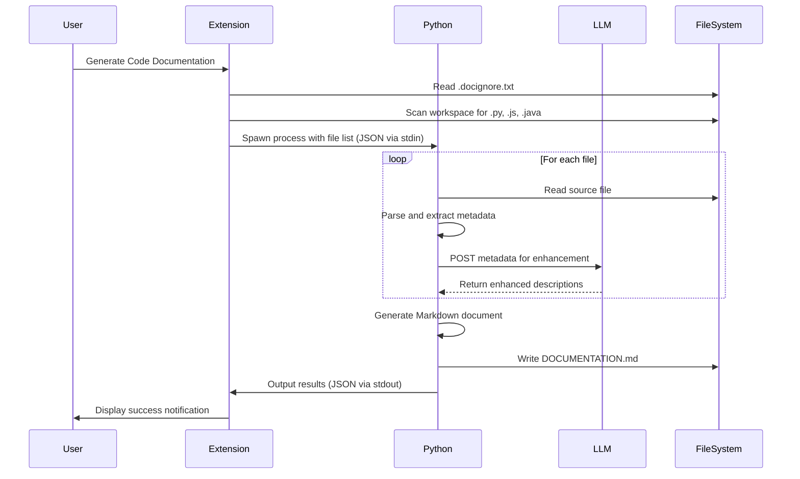

# Design Document: AI-Enhanced Code Documentation Generator

## Overview

The AI-Enhanced Code Documentation Generator is a VS Code extension that automatically generates comprehensive Markdown documentation for source code projects. The system uses a two-component architecture: a TypeScript-based VS Code extension for user interaction and workspace management, and a Python-based analysis engine for static code parsing and LLM integration.

The extension operates entirely through static analysis without executing any user code, ensuring safety and reliability. It supports Python, JavaScript, and Java source files, respects user-defined ignore patterns, and leverages a locally hosted LLM to enhance extracted code metadata with clear, human-readable explanations.

## Architecture

### High-Level Architecture



### Component Architecture

The system consists of three primary components:

1. **VS Code Extension Layer** (TypeScript)
   - Command registration and UI integration
   - Workspace file discovery and filtering
   - Progress notification management
   - Python process lifecycle management
   - Error handling and user feedback

2. **Python Analysis Engine** (Python 3)
   - Static code parsing (ast for Python, regex for JS/Java)
   - Metadata extraction and structuring
   - LLM API communication
   - Markdown generation
   - File I/O operations

3. **Local LLM Service** (External)
   - Receives structured metadata via HTTP POST
   - Generates enhanced documentation descriptions
   - Returns Markdown-formatted content

### Communication Flow



## Components and Interfaces

### 1. VS Code Extension Component

**File Structure:**
```
extension/
├── src/
│   ├── extension.ts          # Main extension entry point
│   ├── commands.ts            # Command handlers
│   ├── fileScanner.ts         # Workspace file discovery
│   ├── ignoreParser.ts        # .docignore.txt parsing
│   ├── pythonBridge.ts        # Python process management
│   └── types.ts               # TypeScript interfaces
├── package.json               # Extension manifest
└── tsconfig.json
```

**Key Interfaces:**

```typescript
interface FileDiscoveryResult {
  files: string[];           // Absolute paths to source files
  ignoredCount: number;      // Number of files excluded
  errors: string[];          // Any discovery errors
}

interface IgnorePattern {
  pattern: string;           // Glob pattern from .docignore.txt
  isDirectory: boolean;      // Whether pattern targets directories
}

interface PythonEngineInput {
  workspacePath: string;     // Absolute path to workspace root
  files: string[];           // List of files to analyze
  llmEndpoint: string;       // LLM API endpoint URL
}

interface PythonEngineOutput {
  success: boolean;
  documentationPath?: string;  // Path to generated DOCUMENTATION.md
  filesProcessed: number;
  filesSkipped: number;
  errors: string[];
}
```

**Core Functions:**

- `activate(context: ExtensionContext)`: Extension activation entry point
- `registerCommands(context: ExtensionContext)`: Register VS Code commands
- `generateDocumentation()`: Main command handler
- `scanWorkspace(ignorePatterns: IgnorePattern[])`: Discover source files
- `parseIgnoreFile(path: string)`: Parse .docignore.txt
- `spawnPythonEngine(input: PythonEngineInput)`: Launch Python analysis
- `handlePythonOutput(stdout: string)`: Process Python results

### 2. Python Analysis Engine Component

**File Structure:**
```
analysis_engine/
├── main.py                    # Entry point, stdin/stdout handling
├── parsers/
│   ├── __init__.py
│   ├── python_parser.py       # Python AST-based parsing
│   ├── javascript_parser.py   # JavaScript regex parsing
│   └── java_parser.py         # Java regex parsing
├── llm_client.py              # LLM API communication
├── markdown_generator.py      # Markdown document generation
└── models.py                  # Data structures
```

**Key Data Structures:**

```python
@dataclass
class Parameter:
    name: str
    type_hint: Optional[str] = None
    default_value: Optional[str] = None

@dataclass
class FunctionMetadata:
    name: str
    parameters: List[Parameter]
    return_type: Optional[str]
    docstring: Optional[str]
    line_number: int

@dataclass
class ClassMetadata:
    name: str
    docstring: Optional[str]
    methods: List[FunctionMetadata]
    line_number: int

@dataclass
class FileMetadata:
    file_path: str
    language: str  # 'python', 'javascript', 'java'
    classes: List[ClassMetadata]
    functions: List[FunctionMetadata]
    parse_errors: List[str]

@dataclass
class LLMRequest:
    metadata: Dict[str, Any]
    prompt_template: str

@dataclass
class LLMResponse:
    enhanced_description: str
    success: bool
    error: Optional[str] = None
```

**Core Functions:**

- `main()`: Entry point, reads JSON from stdin, writes JSON to stdout
- `parse_file(file_path: str, language: str) -> FileMetadata`: Dispatch to appropriate parser
- `parse_python_file(file_path: str) -> FileMetadata`: Use ast module
- `parse_javascript_file(file_path: str) -> FileMetadata`: Regex-based parsing
- `parse_java_file(file_path: str) -> FileMetadata`: Regex-based parsing
- `enhance_with_llm(metadata: FileMetadata) -> str`: Send to LLM and get enhanced docs
- `generate_markdown(all_metadata: List[FileMetadata]) -> str`: Create final document
- `write_documentation(content: str, output_path: str)`: Write DOCUMENTATION.md

### 3. LLM Integration Interface

**API Contract:**

```
Endpoint: POST https://localhosted:11434/api/chat
Content-Type: application/json

Request Body:
{
  "model": "llama2",  // or configured model name
  "messages": [
    {
      "role": "system",
      "content": "You are a technical documentation assistant..."
    },
    {
      "role": "user",
      "content": "Generate documentation for: <structured metadata>"
    }
  ],
  "stream": false
}

Response Body:
{
  "message": {
    "role": "assistant",
    "content": "# Documentation\n\n..."
  }
}
```

**Prompt Strategy:**

The system constructs prompts that include:
1. Structured metadata (class/function names, parameters, existing docstrings)
2. Clear instructions to generate Markdown-only output
3. Request for parameter descriptions and purpose summaries
4. Emphasis on clarity and conciseness

**Fallback Behavior:**

If LLM is unreachable (connection timeout, HTTP error, invalid response):
- Generate basic documentation using only extracted metadata
- Format as simple Markdown with function signatures and existing docstrings
- Log warning but continue processing

## Data Models

### Ignore Pattern Processing

The `.docignore.txt` file follows gitignore-style syntax:

```
# Comments start with #
node_modules/
*.test.js
build/
dist/
__pycache__/
*.pyc
```

**Parsing Rules:**
- Lines starting with `#` are comments (ignored)
- Empty lines are ignored
- Patterns ending with `/` match directories
- Patterns with `*` are glob patterns
- Patterns are relative to workspace root

**Implementation:**
- Use minimatch library (TypeScript) for glob pattern matching
- Convert patterns to regular expressions for efficient matching
- Check each discovered file path against all patterns before adding to processing queue

### Metadata Extraction Patterns

**Python (using ast module):**
```python
# Extract classes
for node in ast.walk(tree):
    if isinstance(node, ast.ClassDef):
        class_name = node.name
        docstring = ast.get_docstring(node)
        
# Extract functions
for node in ast.walk(tree):
    if isinstance(node, ast.FunctionDef):
        func_name = node.name
        params = [arg.arg for arg in node.args.args]
        docstring = ast.get_docstring(node)
```

**JavaScript (regex patterns):**
```javascript
// Function declarations
/function\s+(\w+)\s*\(([^)]*)\)/g

// Arrow functions
/const\s+(\w+)\s*=\s*\(([^)]*)\)\s*=>/g

// Class declarations
/class\s+(\w+)/g

// Method definitions
/(\w+)\s*\(([^)]*)\)\s*{/g
```

**Java (regex patterns):**
```java
// Class declarations
/class\s+(\w+)/g

// Method signatures
/(public|private|protected)?\s*(static)?\s*(\w+)\s+(\w+)\s*\(([^)]*)\)/g
```

### Markdown Document Structure

```markdown
# Project Documentation

*Generated on: [timestamp]*

## Table of Contents
- [Overview](#overview)
- [Files](#files)
  - [file1.py](#file1py)
  - [file2.js](#file2js)

## Overview

[LLM-generated project summary based on all analyzed files]

## Files

### file1.py

**Language:** Python  
**Path:** `src/file1.py`

#### Classes

##### ClassName

[LLM-enhanced description]

**Methods:**

###### method_name(param1, param2)

- **Parameters:**
  - `param1`: [LLM-generated description]
  - `param2`: [LLM-generated description]
- **Purpose:** [LLM-generated purpose]

#### Functions

##### function_name(arg1, arg2)

- **Parameters:**
  - `arg1`: [description]
  - `arg2`: [description]
- **Returns:** [description]
- **Purpose:** [purpose]

---

[Repeat for each file]
```

## Error Handling

### Extension Layer Error Handling

**File System Errors:**
- Workspace not found → Display error: "No workspace folder open"
- .docignore.txt read error → Log warning, proceed without ignore patterns
- Cannot write DOCUMENTATION.md → Display error with permission details

**Python Process Errors:**
- Python not found → Display error: "Python 3 not found in PATH"
- Process spawn failure → Display error with spawn details
- Process crash (non-zero exit) → Display error with stderr output
- Timeout (>5 minutes) → Kill process, display timeout error

**Communication Errors:**
- Invalid JSON from Python → Display error: "Invalid response from analysis engine"
- Unexpected output format → Log warning, attempt to parse partial results

### Analysis Engine Error Handling

**File Parsing Errors:**
- File read permission denied → Log error, skip file, continue
- Syntax error in source file → Log error with line number, skip file, continue
- Unsupported encoding → Log error, skip file, continue

**LLM Communication Errors:**
- Connection timeout (30s) → Log warning, use basic documentation, continue
- HTTP error (4xx, 5xx) → Log warning, use basic documentation, continue
- Invalid JSON response → Log warning, use basic documentation, continue
- Malformed Markdown in response → Sanitize and use, or fall back to basic

**Output Generation Errors:**
- Cannot create DOCUMENTATION.md → Return error to extension with details
- Disk full → Return error to extension
- Invalid characters in output → Sanitize and retry

### Error Recovery Strategy

1. **Fail Fast for Critical Errors:**
   - No workspace folder
   - Python not available
   - Cannot write output file

2. **Continue on Non-Critical Errors:**
   - Individual file parsing failures
   - LLM unavailable or errors
   - Individual file read errors

3. **Graceful Degradation:**
   - LLM unavailable → Use basic documentation
   - Partial parsing success → Document what was successfully parsed
   - Some files skipped → Report count in success message

## Testing Strategy

### Overview

The testing strategy employs both unit tests and property-based tests to ensure comprehensive coverage. Unit tests validate specific examples and edge cases, while property-based tests verify universal correctness properties across randomized inputs.

### Unit Testing

**Extension Layer (TypeScript/Jest):**
- Command registration and activation
- File discovery with various workspace structures
- Ignore pattern parsing with different .docignore.txt formats
- Python process spawning and communication
- Error message formatting
- Progress notification updates

**Analysis Engine (Python/pytest):**
- Python AST parsing for various code structures
- JavaScript regex parsing for different function styles
- Java regex parsing for class and method patterns
- LLM client request formatting
- Markdown generation for different metadata structures
- File I/O operations

**Test Coverage Goals:**
- Extension layer: >80% code coverage
- Analysis engine: >85% code coverage
- Focus on error paths and edge cases

### Property-Based Testing

**Configuration:**
- Library: fast-check (TypeScript), Hypothesis (Python)
- Minimum 100 iterations per property test
- Each test tagged with feature name and property number

**Test Data Generators:**

For Python property tests:
```python
# Generate random Python code structures
@composite
def python_function(draw):
    name = draw(text(alphabet=string.ascii_letters, min_size=1))
    param_count = draw(integers(min_value=0, max_value=5))
    params = [draw(text(alphabet=string.ascii_letters, min_size=1)) 
              for _ in range(param_count)]
    return FunctionMetadata(name=name, parameters=params, ...)

# Generate random file paths
@composite
def file_path(draw):
    depth = draw(integers(min_value=1, max_value=5))
    parts = [draw(text(alphabet=string.ascii_letters, min_size=1)) 
             for _ in range(depth)]
    return '/'.join(parts) + draw(sampled_from(['.py', '.js', '.java']))
```

For TypeScript property tests:
```typescript
// Generate random ignore patterns
const ignorePatternArb = fc.record({
  pattern: fc.stringOf(fc.constantFrom('a-z', '/', '*', '.'), {minLength: 1}),
  isDirectory: fc.boolean()
});

// Generate random file lists
const fileListArb = fc.array(
  fc.stringOf(fc.constantFrom('a-z', '/', '.'), {minLength: 5}),
  {minLength: 0, maxLength: 100}
);
```


## Correctness Properties

*A property is a characteristic or behavior that should hold true across all valid executions of a system—essentially, a formal statement about what the system should do. Properties serve as the bridge between human-readable specifications and machine-verifiable correctness guarantees.*

### Property Reflection

After analyzing all acceptance criteria, several properties can be consolidated to avoid redundancy:

- Properties 1.3 and 1.4 both test ignore pattern matching - combined into Property 1
- Properties 3.2, 3.3, 3.4, 3.5 all test Python extraction completeness - combined into Property 3
- Properties 4.2, 4.3, 4.4, 4.5 all test JS/Java extraction completeness - combined into Property 4
- Properties 5.5 and 10.3 both test LLM fallback behavior - combined into Property 8
- Properties 6.3 and 6.4 both test documentation completeness - combined into Property 10
- Properties 10.1 and 10.2 both test error recovery - combined into Property 14
- Properties 11.2, 11.3, 11.4, 11.5 all test safety constraints - combined into Property 16

### Properties

**Property 1: Ignore pattern exclusion**

*For any* file path and any ignore pattern, if the file path matches the pattern, then the file should not appear in the list of files passed to the Analysis_Engine.

**Validates: Requirements 1.3, 1.4**

---

**Property 2: Recursive workspace scanning**

*For any* workspace directory structure, when scanning is performed, all nested directories should be visited and all files with extensions .py, .js, or .java should be discovered (unless excluded by ignore patterns).

**Validates: Requirements 2.1, 2.2, 2.3**

---

**Property 3: Python metadata extraction completeness**

*For any* valid Python source file, when parsed using the ast module, all classes, all module-level functions, all method definitions, all parameters (with defaults), and all docstrings should be extracted into the FileMetadata structure.

**Validates: Requirements 3.2, 3.3, 3.4, 3.5**

---

**Property 4: JavaScript and Java metadata extraction completeness**

*For any* valid JavaScript or Java source file, when parsed using regex patterns, all classes, all functions/methods, all parameters, and all preceding comment blocks should be extracted into the FileMetadata structure.

**Validates: Requirements 4.2, 4.3, 4.4, 4.5**

---

**Property 5: Metadata JSON serialization**

*For any* FileMetadata object, when formatted for LLM communication, the output should be valid JSON that can be parsed back into an equivalent structure.

**Validates: Requirements 5.1**

---

**Property 6: LLM request format**

*For any* LLM request, the HTTP method should be POST, the endpoint should be https://localhosted:11434/api/chat, and the request body should contain structured metadata and a prompt requesting Markdown output.

**Validates: Requirements 5.2, 5.3**

---

**Property 7: Markdown validation**

*For any* generated DOCUMENTATION.md file, the content should be valid Markdown syntax that can be parsed by a standard Markdown parser without errors.

**Validates: Requirements 6.6, 12.1, 12.3**

---

**Property 8: LLM fallback behavior**

*For any* file being processed, if the LLM is unreachable or returns an error, then basic documentation should be generated using only the extracted metadata, and processing should continue for remaining files.

**Validates: Requirements 5.5, 10.3**

---

**Property 9: Documentation structure completeness**

*For any* generated DOCUMENTATION.md file, it should contain all required sections: Project Overview, Table of Contents, File-wise documentation sections, and proper heading hierarchy.

**Validates: Requirements 6.2, 12.4**

---

**Property 10: Class and function documentation completeness**

*For any* class or function in the extracted metadata, the generated documentation should include the name, all parameters (formatted as a list or table), and a purpose description.

**Validates: Requirements 6.3, 6.4, 12.2**

---

**Property 11: Documentation file overwrite**

*For any* workspace, if DOCUMENTATION.md already exists when generation starts, then after generation completes, the file should contain only the newly generated content (old content should be completely replaced).

**Validates: Requirements 6.5**

---

**Property 12: Extension-Python communication round trip**

*For any* valid PythonEngineInput object, when serialized to JSON and passed via stdin to the Python process, and the Python process outputs PythonEngineOutput via stdout, the Extension should be able to parse the output and extract the results without errors.

**Validates: Requirements 8.2, 8.3, 8.4**

---

**Property 13: Sequential file processing**

*For any* list of files to process, the Analysis_Engine should process them one at a time in sequence, completing all operations (parse, LLM enhancement, metadata storage) for file N before starting file N+1.

**Validates: Requirements 9.1, 9.3**

---

**Property 14: Error recovery and continuation**

*For any* file that cannot be read (permissions) or cannot be parsed (syntax errors), the Analysis_Engine should log the error, skip that file, and continue processing all remaining files in the queue.

**Validates: Requirements 3.6, 10.1, 10.2**

---

**Property 15: Progress reporting frequency**

*For any* workspace with more than 100 files, when processing is in progress, progress updates should be emitted at least once every 10 files processed.

**Validates: Requirements 9.2**

---

**Property 16: Code safety constraints**

*For any* execution of the Analysis_Engine, it should never call eval(), exec(), import modules from the analyzed codebase, or modify any source files in the workspace (only DOCUMENTATION.md should be created/modified).

**Validates: Requirements 11.2, 11.3, 11.4, 11.5**

---

**Property 17: LLM timeout and fallback**

*For any* LLM request that takes longer than 30 seconds, the request should be terminated, and basic documentation should be generated for that file using only extracted metadata.

**Validates: Requirements 9.4**

---

**Property 18: No code execution in parsing**

*For any* JavaScript or Java file being parsed, the Analysis_Engine should use only regex pattern matching and string operations, never invoking any JavaScript or Java runtime or interpreter.

**Validates: Requirements 4.6**

---

**Property 19: Ignore file parsing order**

*For any* workspace where .docignore.txt exists, the ignore patterns should be parsed and loaded before any file scanning begins.

**Validates: Requirements 1.2**

---

**Property 20: Error message specificity**

*For any* error condition (Python process crash, write permission failure, LLM unreachable), the Extension should display an error message that includes specific details about the failure type and context.

**Validates: Requirements 7.5, 10.4, 10.5**

## Testing Strategy

### Dual Testing Approach

The system will employ both unit tests and property-based tests as complementary testing strategies:

- **Unit tests**: Validate specific examples, edge cases, and error conditions
- **Property tests**: Verify universal properties across randomized inputs

Both approaches are necessary for comprehensive coverage. Unit tests catch concrete bugs in specific scenarios, while property tests verify general correctness across a wide input space.

### Unit Testing Focus

Unit tests should focus on:
- Specific examples that demonstrate correct behavior (e.g., parsing a known Python file)
- Integration points between components (e.g., Extension → Python communication)
- Edge cases (e.g., empty files, files with only comments, deeply nested directories)
- Error conditions (e.g., malformed JSON, missing permissions, LLM timeout)

Avoid writing too many unit tests for scenarios that property tests can cover through randomization.

### Property-Based Testing Configuration

**Library Selection:**
- TypeScript/JavaScript: fast-check
- Python: Hypothesis

**Test Configuration:**
- Minimum 100 iterations per property test
- Each test must include a comment tag referencing the design property
- Tag format: `// Feature: ai-code-doc-generator, Property N: [property text]`

**Property Test Implementation:**

Each correctness property listed above must be implemented as a single property-based test. For example:

```typescript
// Feature: ai-code-doc-generator, Property 1: Ignore pattern exclusion
test('ignored files are excluded from processing', () => {
  fc.assert(
    fc.property(
      filePathArb,
      ignorePatternArb,
      (filePath, pattern) => {
        if (matchesPattern(filePath, pattern)) {
          const result = scanWorkspace([pattern]);
          expect(result.files).not.toContain(filePath);
        }
      }
    ),
    { numRuns: 100 }
  );
});
```

```python
# Feature: ai-code-doc-generator, Property 3: Python metadata extraction completeness
@given(python_source_file())
def test_python_extraction_completeness(source_file):
    """For any valid Python file, all structural elements should be extracted"""
    metadata = parse_python_file(source_file)
    
    # Verify all classes in source are in metadata
    expected_classes = extract_classes_with_ast(source_file)
    assert set(metadata.classes) == set(expected_classes)
    
    # Verify all functions in source are in metadata
    expected_functions = extract_functions_with_ast(source_file)
    assert set(metadata.functions) == set(expected_functions)
```

### Integration Testing

Integration tests should verify:
- End-to-end workflow: Command invocation → File scanning → Python execution → Documentation generation
- Extension ↔ Python communication with real child processes
- LLM integration with mock LLM server
- File system operations with temporary test directories

### Test Data Management

**Fixtures:**
- Sample Python, JavaScript, and Java files with various structures
- Sample .docignore.txt files with different pattern types
- Mock LLM responses for different metadata inputs

**Generators:**
- Random Python AST structures (using Hypothesis strategies)
- Random file paths and directory structures
- Random ignore patterns (glob patterns, directory patterns)
- Random metadata objects

### Coverage Goals

- Extension layer (TypeScript): >80% code coverage
- Analysis engine (Python): >85% code coverage
- All error handling paths must be tested
- All property-based tests must pass with 100 iterations

### Continuous Testing

- Run unit tests on every commit
- Run property tests on every pull request
- Run integration tests before release
- Monitor test execution time (property tests should complete in <2 minutes)
